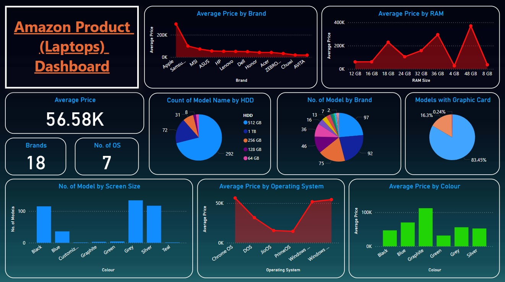

# Amazon Product Scraping & Analysis

## Overview

This project involves the extraction, analysis, and visualization of Amazon laptop product data. By leveraging web scraping tools like Selenium and BeautifulSoup, we gathered extensive data from Amazon product pages. The data was then cleaned and analyzed using Microsoft Excel and Pandas. Finally, the insights were visualized through interactive dashboards created in Power BI.

## Project Structure

The project is organized into the following key sections:

- **Web Scraping:** Using Selenium and BeautifulSoup to extract data from Amazon product pages.
- **Data Parsing & Cleaning:** Parsing the HTML content and cleaning the data using Pandas and Microsoft Excel.
- **Data Visualization:** Creating interactive dashboards with Power BI to analyze trends and insights.

## Features

- **Web Scraping with Selenium and BeautifulSoup:** Automated extraction of laptop product details from Amazon, including brand, model, screen size, and price.
- **Data Cleaning with Excel:** Ensuring data integrity by refining and structuring the dataset.
- **Data Analysis with Pandas:** Manipulating and analyzing the cleaned data to draw meaningful insights.
- **Interactive Dashboards with Power BI:** Visualizing the data trends and patterns in a user-friendly and interactive way.

## Installation

### Prerequisites

- Python 3.x
- Selenium
- BeautifulSoup4
- Pandas
- Microsoft Excel
- Power BI

### Steps to Run

1. **Clone the Repository:**
    ```sh
    git clone https://github.com/yourusername/amazon-product-analysis.git
    cd amazon-product-analysis
    ```

2. **Install Dependencies:**
    ```sh
    pip install -r requirements.txt
    ```

3. **Run the Web Scraping Script:**
    ```sh
    python scrape_amazon.py
    ```

4. **Clean and Parse Data:**
    - Open the generated CSV file in Microsoft Excel.
    - Use the provided Excel script for cleaning the data.

5. **Visualize Data in Power BI:**
    - Open the provided Power BI file (`amazon_product_analysis.pbix`).
    - Analyze and interact with the dashboards.

## Key Insights

The following insights were derived from the analysis:

1. **Average Price Insights:**
   - **By Brand:** Apple laptops are the most expensive, followed by Samsung and MSI.
   - **By RAM:** Laptops with higher RAM (e.g., 48 GB) command higher prices.

2. **Model Distribution:**
   - **By HDD:** 512 GB HDD models are the most common.
   - **By Brand:** HP has the most models listed, followed by Dell and Lenovo.

3. **General Statistics:**
   - **Brands:** The data includes 18 different brands.
   - **Operating Systems:** There are 7 different operating systems represented.

4. **Features:**
   - A significant majority (83.45%) of laptops do not have a dedicated graphic card.

## Power BI Dashboard

You can view the interactive Power BI dashboard [here](https://app.powerbi.com/reportEmbed?reportId=f8286d26-2899-454c-a735-0c0d17d2e42b&autoAuth=true&ctid=40357f77-213c-4ea0-9e9a-8784e5b36407).

### Screenshots



## Contributing

Contributions are welcome! Please feel free to submit a pull request or open an issue if you have suggestions for improvements.


